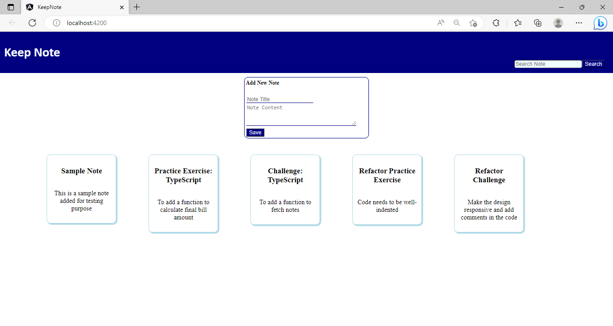
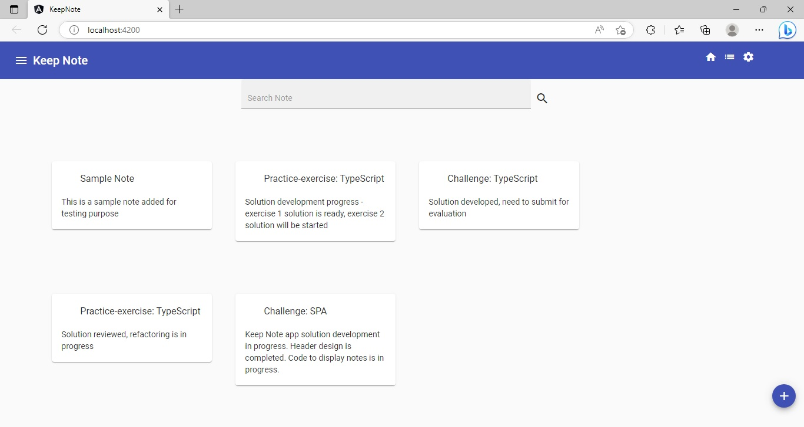

## Challenge - Style the `Keep-Note` Application using Angular Material
 

### Points to Remember
- Appropriate Angular Material components should be used for styling the application.​
- Pre-built theme color palettes should be applied consistently across all the Angular Material components in the application.
- The Angular Material navigation schematics should be used to quickly add a toolbar and a side navigation bar to the application.
- The Angular Material component selectors should not be used to define the CSS style properties. ​
    - Instead, define `id` or `class` attributes on the elements and use them as CSS selectors to define the style rules.

​
### Instructions for Challenge

- Fork the boilerplate into your own workspace. ​
- Clone the boilerplate into your local system. ​
- Open command terminal and set the path to the folder containing the cloned boilerplate code.​
- Run the command `npm install` to install the dependencies.
- Use the solution code of the `Keep-Note` application developed in the challenge of the sprint, `Sprint 5: Build Reusable Application Logic Using Angular Services` of the Angular Course: `Building Single Page Applications Using Angular`.​

Notes:
1. The solution of this challenge will undergo an automated evaluation on the `CodeReview` platform. (Local testing is recommended prior to the testing on the `CodeReview` platform)
2. The test cases are available in the boilerplate.

### Context

As you are aware, `Keep-Note` is a web application that allows users to maintain notes. It is developed as a single-page application using multiple components. 

Note: The stages through which the development process will be carried out are shown below:
- Stage 1: Create basic `Keep-Note` application to add and view notes.
- Stage 2: Implement unit testing for the `Keep-Note` application.
- Stage 3: Create `Keep-Note` application with multiple interacting components to add, view and search notes.
- Stage 4: Implement persistence in the `Keep-Note` application.
- **Stage 5: Style the `Keep-Note` application using Material design.**
- Stage 6: Create simple form with validation in the `Keep-Note` application.
- Stage 7: Create complex form with validation in the `Keep-Note` application.
- Stage 8: Enable navigation in the `Keep-Note` application.
- Stage 9: Secure routes in the `Keep-Note` application

In this sprint, we are at Stage 5.

Till this stage, the layouts and appearance of UI of the `Keep-Note` application were defined using the CSS style properties.

In this stage, for pleasing aesthetics and a rich user experience, the looks of the `Keep-Note` application should be enhanced by using the Angular Material library.

#### Output Without Angular Material

#### Output with Angular Material

### Problem Statement

Style the `Keep-Note` application using the Angular Material components, schematics and a pre-built theme.

​Note: Tasks to complete the challenge are given below: 

#### Task 1: Install Angular Material
- Install Angular Material packages using the Angular CLI command.
- During installation, select a pre-built theme, allow Angular Material typography styles to be installed, and opt for `Include and enable animations`.

#### Task 2: Style the `HeaderComponent`
- The `HeaderComponent` should be styled using the Angular Material `Toolbar` component.
- It should contain the application title `Keep Note`.
- It should also contain navigation icons designed using Angular Material `Icon` component.

Note: Click on the links given below to know more about these Angular Material components:
- [Toolbar component](https://material.angular.io/components/toolbar/overview).
- [Icon component](https://material.angular.io/components/icon/overview).

#### Task 3: Style the `NoteAddComponent`
- Use Angular Material `Input` and `Button` components for styling the `NoteAddComponent`.
    - It is recommended that, to keep the UI clutter-free, the view for the `NoteAddComponent` should be hidden/collapsed and visible only when the user clicks on a button. 
- The input field should contain appropriate labels to instruct the user about the input required. 

Note: Click on the links given below to know more about these Angular Material components:
- [Form field component](https://material.angular.io/components/form-field/overview).
- [Button component](https://material.angular.io/components/button/overview).

#### Task 4: Style the `NoteViewComponent`
- Use Angular Material `Card` component to display the notes in the card format on the NoteViewComponent.
- Add more icon buttons, using Angular Material `Button` and `Icon` components, in the card footer for commenting, editing, deleting, and setting up reminders on the selected note. 
- For a clutter-free UI, the buttons on the note card can be kept hidden, and they are visible only when the note is selected or hovered. 

Notes: 
1. Click on the link given below to know more about the Angular Material Card component:
    - [Card component](https://material.angular.io/components/card/overview).
2. Refer to the link below to explore suitable Material Icons that should be used in the Note card:
    - [Material Symbols and Icons - Google Fonts](https://fonts.google.com/icons)

#### Task 5: Style the `SearchComponent`
- The `SearchComponent` design can be kept simple by having only an input field that accepts note title as the input to search.
- A search icon can be used with the search input field to suggest its intended purpose.
Use Angular Material `Form Field`, `Button` and `Icon` components for styling the `SearchComponent`.

#### Task 6: Add `NavBarComponent` using the `Navigation` Schematics
- Use the Angular Material `Navigation` schematics to add a component with the name `NavBar` to the `Keep-Note` application.
- Refactor the existing code so that the newly added component displays a collapsible sidebar, a toolbar with the application title and a content area for rendering the note contents.
- The sidebar should display following links:
    - Home
    - New Note
    - Archives
    - Settings

Notes: 
1. The links should be accompanied with the appropriate icons..
2. Refer to the link below to explore suitable Material Icons that should be used in the sidebar:
    - [Material Symbols and Icons - Google Fonts](https://fonts.google.com/icons).

### Test the Solution Locally​

Test the solution first locally and then on the `CodeReview` platform. Steps to test the code locally are:
- From the command line terminal, set the path to the folder containing cloned boilerplate code.
- Run the command `ng test` or `npm run test` to test the solution locally and ensure all the test cases pass.
- Refactor the solution code if the test cases are failing and do a re-run.​
- Finally, push the solution to git for automated testing on the CodeReview platform.

### Test the Solution on the `CodeReview` Platform

Steps to test the code on the `CodeReview` platform are:
- Open the submission page at [https://codereview.stackroute.niit.com/#/submission](https://codereview.stackroute.niit.com/#/submission).
- Submit the solution.
- For the failed test cases, refactor the code locally and submit it for re-evaluation.
